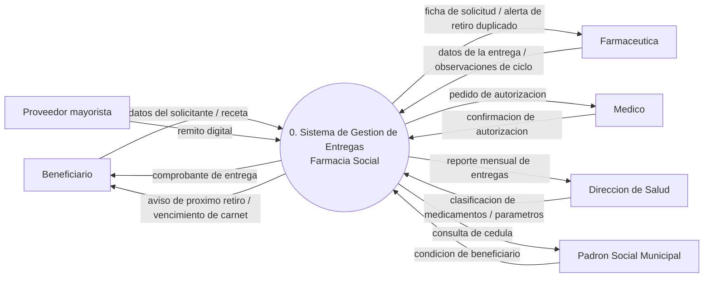
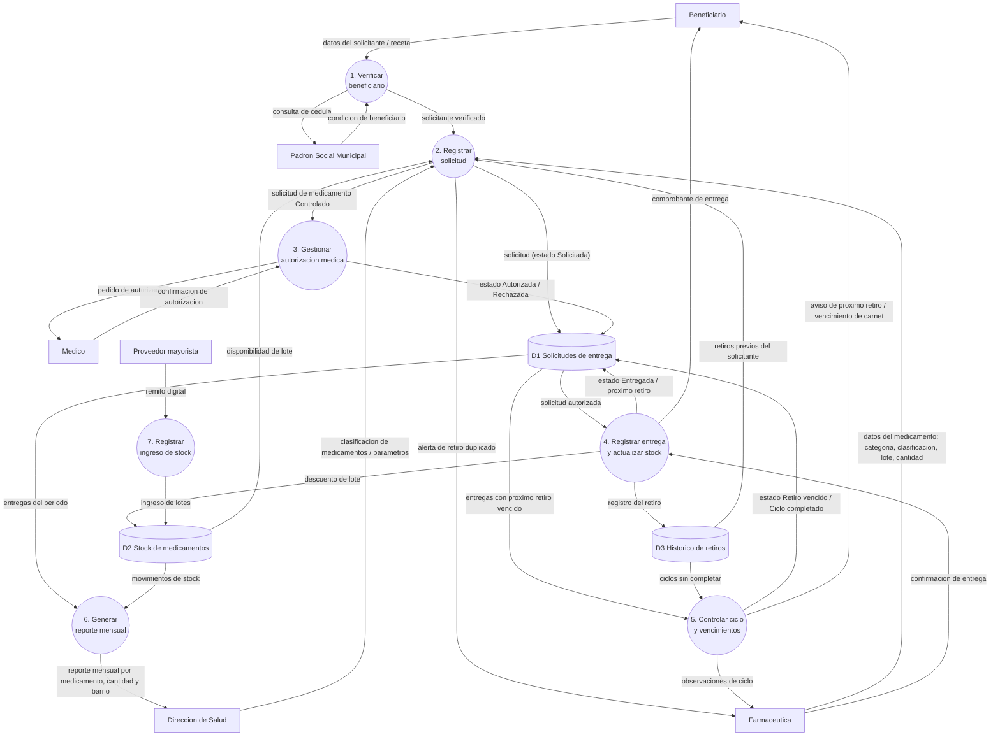

# SOLUCIONARIO Y RÚBRICA · Simulacro Parcial ISO1 — Fila S1

> ⚠️ **Abrí este archivo recién después de haber resuelto el simulacro completo.**
> Las respuestas de la Parte III son **una** solución correcta posible, no la única. Lo que se califica es la coherencia con el caso y con el material de clase.

---

# PARTE I — Teoría (6 puntos)

## I.A · Opción múltiple (1 pt c/u)

| # | Resp. | Por qué |
|---|---|---|
| **1** | **b** | El software son **programas ejecutables + estructuras de datos + documentación asociada**. (a) reduce el software al código —el error que la Clase 1 busca desarmar—; (c) incluye hardware y personas, que no son el producto software; (d) son actividades del proceso, no componentes del producto. |
| **2** | **c** | Requisitos **estables y bien comprendidos desde el inicio** + exigencia de documentación formal = escenario típico de **cascada**. (a) y (d) ignoran la estabilidad del dominio; (b) describe partes que avanzan a ritmos distintos, que no es el caso. |
| **3** | **c** | El Manifiesto **no descarta** procesos, documentación, contratos ni planes: reconoce su valor y **prioriza** la columna izquierda al decidir. (b) es el error clásico: en ágil el cambio **sí** cuesta, pero el proceso mantiene ese costo **bajo y estable**. |
| **4** | **d** | Notación Pressman: entidad externa = **cuadro**; proceso = **círculo/burbuja** (nunca rectángulo); almacén = **dos líneas paralelas sin cerrar los costados**; flujo = **flecha etiquetada**. |

## I.B · Verdadero / Falso con justificación (0,5 c/u)

| # | V/F | Justificación esperada |
|---|---|---|
| **5** | **FALSO** | Un actor es el **rol** que se desempeña, no una persona específica; además puede ser un **dispositivo o sistema externo**. Una misma persona puede ser dos actores distintos (en el caso: el Dr. Villalba es *solicitante* cuando retira insumos y *médico autorizante* cuando aprueba la entrega de otro). |
| **6** | **FALSO** | Lineamiento 1 de Pressman: **el Nivel 0 (diagrama de contexto) ilustra el sistema como una sola burbuja**, sin importar su tamaño. El detalle aparece recién al "explosionar" esa burbuja en el Nivel 1. |
| **7** | **FALSO** | Es un requisito **no funcional**: restringe **cómo debe ser** la solución (rendimiento / tiempo de respuesta), no describe **qué hace** el sistema. |
| **8** | **FALSO** | Los principios **no reemplazan** a procesos ni frameworks: son el **criterio** que permite usarlos bien, adaptarlos o incluso cuestionarlos cuando no encajan con la realidad del proyecto. |

> **Criterio de corrección I.B:** V/F correcto **sin** justificación válida = **0**. V/F incorrecto = 0 aunque la justificación tenga algo rescatable.

---

# PARTE II — Aplicación breve (4 puntos)

## 9. QFD (1 pt — 0,33 c/u)

| | Clasificación | Justificación |
|---|---|---|
| **a** | **Normal** | Objetivo **declarado explícitamente** por el cliente. |
| **b** | **Esperado** | **Implícito** en el producto: nadie lo pide, pero su ausencia genera insatisfacción inmediata. |
| **c** | **Exigente / emocionante** | Va **más allá de lo esperado**; el cliente no lo pidió y genera satisfacción al encontrarlo. |

## 10. Principios de actividad estructural (1 pt — 0,33 c/u)

| | Actividad | Principio vulnerado |
|---|---|---|
| **a** | **Comunicación** | *"Prepararse antes de comunicarse"*: toda reunión o intercambio con el cliente necesita preparación previa. (También es aceptable "escuchar antes de hablar" si se argumenta bien, pero el núcleo acá es la falta de preparación.) |
| **b** | **Despliegue** | *"Proveer un paquete de instrucciones completo **antes** de la entrega, no después de un reclamo"*. Se relaciona también con *gestionar las expectativas del cliente*. |
| **c** | **Modelado** | *"El propósito del modelo es facilitar la comprensión, no producir documentación por sí misma"* + *"no agregar complejidad innecesaria: es una herramienta de comunicación, no un fin en sí mismo"*. Conecta con el principio de la presentación: *"el modelo se construye para entender, no para archivar"*. |

## 11. Elección de enfoque (1 pt)

**Decisión: enfoque ÁGIL.** (0,25)

**Criterios técnicos del cuadro comparativo — se piden al menos dos (0,5):**
1. **Estabilidad de los requerimientos:** el cliente cambia de idea casi semanalmente. En un modelo prescriptivo el costo del cambio **crece fuertemente** con el avance del proyecto; el enfoque ágil mantiene ese costo **bajo y estable** mediante iteraciones cortas y retroalimentación continua.
2. **Disponibilidad del cliente para retroalimentación continua:** está disponible a diario. Esa disponibilidad es **condición necesaria** para que XP o Scrum funcionen (sin ella, ambos pierden buena parte de su efectividad).
3. **Calendarización:** necesita **algo funcionando en seis semanas** → planificación adaptativa por iteraciones cortas, no planificación detallada de largo plazo.
4. **Tamaño y experiencia del equipo:** 5 personas = equipo pequeño, con capacidad de autoorganización.

**Práctica/elemento concreto (0,25) — cualquiera de estas, bien justificada:**
- **Entregas pequeñas y frecuentes (XP)** o **Sprint de 2 semanas con Sprint Review (Scrum)**: permite mostrar un incremento funcional antes de las seis semanas y recoger la reacción real de los socios.
- **Cliente in situ (XP)**: acá se cumple en su versión práctica (disponible a diario por WhatsApp), lo que habilita resolver dudas sin frenar la iteración.
- **Product Owner / Product Backlog priorizado (Scrum)**: ordena los cambios semanales en una lista priorizada en lugar de que entren como interrupciones.

## 12. Errores de relevamiento (1 pt — 0,33 c/u)

| | Error |
|---|---|
| **a** | **Hablar solo con un participante** — el sistema termina reflejando una sola mirada y deja afuera a los cajeros, que son los usuarios finales. |
| **b** | **Confundir solución con requisito** — "botón rojo arriba a la derecha" es una solución; el requisito real podría ser "necesito distinguir visualmente la acción urgente". |
| **c** | **No dejar registro escrito** — sin minuta, cada participante recuerda una versión distinta de lo acordado. |

---

# PARTE III — Caso práctico (10 puntos)

## Consigna 1 — Participantes y conflicto (2 puntos)

### 1.a · Participantes (1 pt: 0,25 por participante bien tipificado con su interés)

| # | Participante | Tipo (clasificación de clase) | Interés principal |
|---|---|---|---|
| 1 | **Dra. Alicia Rojas**, directora de Salud | **Gerente / directivo** (también actúa como **cliente**: solicita el sistema y define el alcance) | Trazabilidad total: autorización médica sin excepción para medicamentos controlados, y reporte mensual por medicamento, cantidad y barrio para negociar la compra del semestre |
| 2 | **Q.F. Lorena Duarte**, farmacéutica a cargo | **Usuario final** | Entregar el medicamento **en el momento**, sin trabar la cola; y evitar los **retiros duplicados** entre sucursales |
| 3 | **Dr. Hugo Villalba**, médico | **Usuario final** (con **doble rol**: solicitante cuando retira insumos, y autorizante cuando aprueba) | Poder **confirmar la autorización desde el celular**, sin firmar papel |
| 4 | **Sra. Teresa Ayala**, beneficiaria | **Usuario final** | Recibir **aviso del próximo retiro** y del **vencimiento del carnet** del padrón, antes de llegar a la ventanilla |
| 5 | **Dirección de Acción Social — Padrón Social Municipal** | **Proveedor / tercero** (sistema externo con el que se integra) | Que su padrón sea **solo consultado, nunca modificado** por el nuevo sistema |
| 6 | **Proveedor mayorista** (licitación) | **Proveedor / tercero** | Que sus **remitos digitales** se registren correctamente en el stock |
| 7 | **Equipo de desarrollo** | **Ingenieros de software** | Traducir estas necesidades en una solución técnica viable y mantenible |

> Con **cuatro** bien tipificados alcanza el puntaje. Se descuenta si se inventan categorías fuera de las seis vistas (clientes, usuarios finales, gerentes/directivos, ingenieros de software, marketing/negocio, proveedores/terceros), o si se confunde a la farmacéutica con "cliente" (ella usa el sistema, no lo solicita ni lo paga).

### 1.b · El conflicto de requisitos (1 pt)

**El conflicto (0,3):** la **Dra. Rojas** exige que **toda** entrega de medicamento *controlado* tenga autorización médica previa, **sin excepción** (requisito de control y trazabilidad, de origen gerencial y normativo). La **Q.F. Duarte** sostiene que esperar la confirmación del médico **traba la cola** y necesita poder entregar en el momento (requisito de agilidad operativa, de origen del usuario final). Ambos tienen razón desde su lugar: no es un malentendido, es un **conflicto genuino de intereses**.

**Cómo debe proceder el ingeniero de requisitos (0,4):**
- **No decidir por su cuenta ni "promediar"** los puntos de vista. Reconocerlos **explícitamente**, como dice el material de la U5.
- **Separar hechos del dominio de preferencias personales:** si la exigencia de autorización para medicamentos controlados responde a una **norma sanitaria**, es un hecho del dominio y no es negociable; si responde solo a una preferencia de control interno, sí lo es. Esto se verifica preguntando, no asumiendo.
- **Buscar primero los puntos de acuerdo** como base común: ambos quieren evitar entregas indebidas y que no se pierda el control del medicamento.
- Llevar el conflicto a la **etapa 2 de la Ingeniería de Requisitos — Análisis y negociación**, en una **reunión de recabación colaborativa** con ambos participantes presentes, con facilitador y mecanismo de definición visible.
- Identificar **quién tiene autoridad para establecer prioridades** (pregunta libre de contexto de Pressman, familia "sobre la eficacia"): la decisión final es del cliente, no del analista.

**Cómo se refleja en el modelo mientras no esté resuelto (0,3):**
- **Documentarlo y priorizarlo, no esconderlo:** queda registrado como **conflicto abierto** en la lista de requerimientos agrupada por afinidad, con ambos requisitos enunciados y marcados "en negociación".
- En el **caso de uso formal** se refleja como un **flujo alterno explícito** (A2: *el medicamento es Controlado y el médico no confirma en el momento* → la solicitud queda en estado **Solicitada / pendiente de autorización** y **no se entrega**), de modo que el modelo **soporta la postura restrictiva sin cerrar la puerta** a la alternativa.
- En el **modelo de datos / almacén de solicitudes**, el estado `Solicitada` se mantiene separado de `Autorizada`, y la **autorización se modela como un atributo opcional condicionado a la clasificación del medicamento** — así, si la negociación habilita una excepción (p. ej. autorización diferida con registro del motivo), el cambio es de **regla de negocio**, no de estructura.
- Queda **registrado por escrito** en el acta de relevamiento (evita el error "no dejar registro escrito").

---

## Consigna 2 — Caso de uso formal (3 puntos)

### **Caso de uso: Registrar la entrega de un medicamento**

**Actor principal:** Q.F. farmacéutica a cargo (rol *Farmacéutica*).

**Actores secundarios:**
- Solicitante (rol *Beneficiario* o rol *Personal de salud*)
- Médico autorizante
- **Padrón Social Municipal** (sistema externo, solo consulta)

**Objetivo en contexto:** registrar en el sistema la entrega de un medicamento a un solicitante verificado, dejando trazabilidad del lote, la cantidad, la autorización médica cuando corresponda y la fecha del próximo retiro previsto.

**Precondiciones:**
1. La farmacéutica está autenticada en el sistema con su perfil.
2. El solicitante se identifica con cédula (beneficiario) o legajo (personal de salud).
3. El medicamento solicitado existe en el stock, con **código de lote** y cantidad disponible mayor a la solicitada.
4. El sistema tiene acceso de **consulta** al Padrón Social Municipal.

**Disparador:** el solicitante se presenta en la ventanilla de la Farmacia Social para retirar un medicamento.

**Flujo básico:**
1. La farmacéutica inicia el registro de una nueva entrega.
2. La farmacéutica ingresa el **tipo de solicitante** (Beneficiario / Personal de salud) y el **N.º de cédula / legajo**.
3. El sistema **consulta el Padrón Social Municipal** y obtiene la condición del solicitante.
4. El sistema confirma que el solicitante está **vigente** y muestra sus datos y su **historial de retiros**.
5. El sistema verifica que **no exista un retiro del mismo tratamiento con ciclo anterior sin completar**.
6. La farmacéutica registra el medicamento: **categoría** (Crónico / Antibiótico / Insumo / Otro), **clasificación** (Controlado / Libre), **código de lote** y **cantidad**.
7. El sistema asigna el **N.º de entrega** y crea la solicitud en estado **`Solicitada`**.
8. Como la clasificación es **Controlado**, el sistema envía al **médico autorizante** un pedido de confirmación a su dispositivo móvil.
9. El médico confirma la autorización; el sistema registra al **médico autorizante** y pasa la solicitud al estado **`Autorizada`**.
10. La farmacéutica entrega el medicamento y confirma la entrega en el sistema.
11. El sistema registra **fecha y hora de entrega**, descuenta la cantidad del lote en el stock y calcula el **próximo retiro previsto**.
12. El sistema pasa la solicitud al estado **`Entregada`** y programa el **aviso de próximo retiro** al beneficiario.

**Flujos alternos / excepciones:**

- **A1 — El solicitante no está vigente en el Padrón Social.**
  En el paso 4, el padrón devuelve condición *no vigente* o *carnet vencido*. El sistema no permite continuar, registra la solicitud en estado **`Rechazada`** con el motivo en *Observaciones*, e informa al solicitante el motivo y la vía de regularización. El caso de uso termina.

- **A2 — Medicamento Controlado sin confirmación médica en el momento** *(este flujo es el que refleja el conflicto de requisitos todavía abierto)*.
  En el paso 9 el médico no responde dentro del plazo definido. La solicitud **permanece en estado `Solicitada` (pendiente de autorización)**, el medicamento **no se entrega** y el sistema mantiene el pedido de confirmación activo. Cuando el médico confirma, el flujo se retoma desde el paso 10. El caso de uso termina sin entrega.

- **A3 — Retiro duplicado detectado.**
  En el paso 5 el sistema encuentra un retiro del mismo tratamiento cuyo ciclo anterior no figura completado. El sistema emite una **alerta** a la farmacéutica, bloquea la entrega, registra la solicitud como **`Rechazada`** con el motivo en *Observaciones* e **informa a la Dirección de Salud**. El caso de uso termina.

- **A4 — El Padrón Social Municipal no está disponible.**
  En el paso 3 el sistema externo no responde. El sistema informa la indisponibilidad, **no completa la verificación** y deja la solicitud en estado **`Solicitada`** con la verificación marcada como pendiente; la entrega no se registra hasta poder verificar. Queda asentado el intento para auditoría.

- **A5 — Stock insuficiente del lote.**
  En el paso 6 la cantidad solicitada supera la disponible. El sistema lo informa y ofrece registrar una entrega parcial —si la regla de negocio lo permite— o **`Rechazada`** por *faltante de stock*, con el motivo en *Observaciones*.

- **A6 — El solicitante es personal de salud.**
  En el paso 8, si el tipo de solicitante es *Personal de salud*, el sistema **omite el pedido de autorización médica** (según la nota del FORM-FAR-04) y el flujo continúa directamente en el paso 10.

**Postcondiciones:**
1. La solicitud queda en estado **`Entregada`**, con su **N.º de entrega** asignado y la fecha y hora registradas.
2. El **stock** del lote entregado queda descontado en la cantidad entregada.
3. Queda registrada la **fecha de próximo retiro previsto** y **programado el aviso** al beneficiario.
4. El **historial de retiros** del solicitante incorpora esta entrega, quedando disponible para el control de duplicados y de ciclo.
5. Si la entrega fue de un medicamento Controlado, queda asentado el **médico autorizante** y el momento de su confirmación.
6. La entrega queda disponible para el **reporte mensual** por medicamento, cantidad y barrio.

### Rúbrica de la consigna 2 (3 pts)

| Criterio | Puntos |
|---|---|
| Nombre, actor principal y actores secundarios correctos (incluye el sistema externo como actor secundario) | 0,4 |
| Objetivo en contexto bien formulado (qué logra el actor, no qué hace el sistema por dentro) | 0,3 |
| Precondiciones verificables y propias del caso (no genéricas) | 0,4 |
| Disparador explícito | 0,2 |
| Flujo básico numerado, coherente y **con los atributos reales del FORM-FAR-04** (tipo de solicitante, categoría, clasificación, lote, cantidad, próximo retiro) | 0,8 |
| **Al menos dos** flujos alternos, que sean **excepciones reales del caso** | 0,6 |
| Postcondiciones explícitas y en términos de **estado del sistema** | 0,3 |
| **Descuentos:** usar estados inventados en vez de los del formulario (−0,3) · redactar el flujo como pantallas/implementación, "diseño encubierto" (−0,3) · omitir las postcondiciones, que es el campo que falta en el ejemplo de CasaSegura (−0,3) | |

---

## Consigna 3 — DFD (3 puntos)

### Narración + análisis gramatical (el paso previo que conviene mostrar)

> **Verbos → procesos:** verificar, registrar, autorizar, entregar, controlar, avisar, generar (reporte), ingresar (stock).
> **Sustantivos → entidades / flujos / almacenes:** beneficiario, farmacéutica, médico, Dirección de Salud, Padrón Social, proveedor mayorista *(entidades externas)*; solicitud, receta, autorización, remito, reporte *(flujos)*; solicitudes, stock, histórico de retiros *(almacenes)*.

### DFD — Nivel 0 (diagrama de contexto)

**Una sola burbuja.** Solo interesa qué cruza la frontera del sistema.

> ⚠️ En el papel: **entidades = cuadros**, **el sistema = UNA burbuja (círculo)**, **todas las flechas etiquetadas**. La flecha hacia el Padrón es de **consulta**: no sale ningún flujo que lo modifique — esa es la restricción del caso, y conviene anotarla.

### DFD — Nivel 1

La burbuja 0 se descompone. Aparecen los **almacenes**.

### Verificación de continuidad del flujo (lo que más se evalúa)

| Flujo en Nivel 0 | Dónde reaparece en Nivel 1 |
|---|---|
| `datos del solicitante / receta` (Beneficiario → sistema) | Entrada de **P1 Verificar beneficiario** |
| `consulta de cédula` / `condición de beneficiario` (↔ Padrón) | Entradas y salidas de **P1** |
| `datos de la entrega` (Farmacéutica → sistema) | Entradas de **P2** y **P4** |
| `pedido de autorización` / `confirmación de autorización` (↔ Médico) | Entradas y salidas de **P3** |
| `aviso de próximo retiro / vencimiento` (sistema → Beneficiario) | Salida de **P5** |
| `reporte mensual de entregas` (sistema → Dirección de Salud) | Salida de **P6** |
| `remito digital` (Proveedor → sistema) | Entrada de **P7** |

> **Ningún flujo del Nivel 1 cruza la frontera sin estar en el Nivel 0, y ninguno del Nivel 0 desaparece en el Nivel 1.** Eso es la *continuidad del flujo de información* (lineamiento 5 de Pressman).

### Patrones de modelado reconocidos (vale puntos reconocerlos)

- **Transacción / Ciclo de vida:** la **solicitud de entrega** es la entidad central que atraviesa estados — `Solicitada → Autorizada → Entregada → Ciclo completado`, con las ramas `Retiro vencido` y `Rechazada`. Por eso **D1** se modela con un campo **estado** y transiciones válidas.
- **Rol / Actor:** el **solicitante** es una sola entidad con un atributo *tipo* (Beneficiario / Personal de salud) que determina si requiere autorización, en lugar de modelar dos actores separados. El Dr. Villalba lo muestra: la misma persona es solicitante en un caso y autorizante en otro.

### Rúbrica de la consigna 3 (3 pts)

| Criterio | Puntos |
|---|---|
| Nivel 0 con **una sola burbuja** | 0,4 |
| Entidades externas correctas y completas (incluye **Padrón Social** y **Proveedor** como terceros) | 0,4 |
| **Notación correcta**: procesos en círculo (no rectángulo), almacenes en dos líneas paralelas, entidades en cuadro | 0,5 |
| **Todas** las flechas y burbujas etiquetadas con nombres significativos | 0,4 |
| Nivel 1 con **al menos 4 procesos** y **al menos un almacén** | 0,5 |
| **Continuidad del flujo** verificable entre Nivel 0 y Nivel 1 | 0,6 |
| Reconocimiento de al menos un patrón de modelado, justificado | 0,2 |
| **Descuentos graves:** usar rombos de decisión o secuencia temporal → es un diagrama de flujo de algoritmo, no un DFD (−1,0) · dibujar procesos como rectángulos (−0,5) · poner el Padrón Social como *almacén de datos* en lugar de *entidad externa* (−0,4) · flechas sin etiquetar (−0,4) | |

> **Error conceptual más caro:** poner el **Padrón Social Municipal** como almacén interno. Es un **sistema externo administrado por otra dirección**, que el sistema **solo consulta** → va como **entidad externa (cuadro)**, fuera de la frontera.

---

## Consigna 4 — Registro crítico del uso de IA (2 puntos)

No hay una respuesta "correcta": se evalúa la **honestidad y la calidad del criterio**. Ejemplo de tabla que obtiene el puntaje completo:

| N.º | Herramienta | Prompt o consulta | Qué propuso la IA | Tu decisión | Fundamento |
|---|---|---|---|---|---|
| 1 | Claude | "Identificá los stakeholders del caso de la Farmacia Social y clasificalos" | Listó 5 participantes y clasificó a la farmacéutica como "cliente" | **Corregida** | La farmacéutica **usa** el sistema pero no lo solicita ni define el alcance: según la clasificación de la U5 es **usuario final**; el cliente es la Dirección de Salud. También agregué al **Padrón Social** y al **proveedor mayorista** como *proveedores/terceros*, que la IA había omitido |
| 2 | Claude | "Redactá el DFD de nivel 1 de este sistema" | Propuso un diagrama con **rombos de decisión** para "¿es controlado?" y procesos en rectángulos | **Descartada** | Un DFD **no tiene rombos de decisión ni secuencia temporal**: eso es un diagrama de flujo de algoritmo. En la notación de Pressman los procesos son **círculos** y la condición "Controlado" se modela como un **flujo etiquetado** hacia el proceso de autorización, no como una decisión |
| 3 | Claude | "Escribí el caso de uso formal de registrar la entrega" | Entregó un caso de uso completo pero **sin postcondiciones** | **Corregida** | Es exactamente la omisión que la cátedra marca en el ejemplo **AVC-MVC de CasaSegura** (Pressman, Cap. 6, p. 136): la consigna **sí** pide postcondiciones explícitas. Las agregué en términos de **estado del sistema** |

### Rúbrica de la consigna 4 (2 pts)

| Criterio | Puntos |
|---|---|
| Tres decisiones registradas, con prompt y propuesta identificables | 0,6 |
| **Al menos una** decisión **Corregida o Descartada** (si las tres son "Aceptada", máximo 0,8 en toda la consigna) | 0,6 |
| Fundamento con **referencia concreta** al material de clase, a Pressman o al caso (no "porque me pareció mejor") | 0,8 |

---

# Hoja de puntaje

| Parte | Ítem | Puntos | Obtenidos |
|---|---|---|---|
| I.A | Opción múltiple (4 × 1) | 4 | |
| I.B | V/F con justificación (4 × 0,5) | 2 | |
| II | 9. QFD | 1 | |
| II | 10. Principios estructurales | 1 | |
| II | 11. Ágil vs. prescriptivo | 1 | |
| II | 12. Errores de relevamiento | 1 | |
| III | 1. Participantes y conflicto | 2 | |
| III | 2. Caso de uso formal | 3 | |
| III | 3. DFD Nivel 0 y Nivel 1 | 3 | |
| III | 4. Registro crítico de IA | 2 | |
| | **TOTAL** | **20** | |

### Qué hacer con tu resultado

| Puntaje | Diagnóstico | Qué repasar |
|---|---|---|
| **17–20** | Dominio sólido | Afinar la notación del DFD y la precisión de las postcondiciones |
| **13–16** | Bien, con huecos puntuales | Volver sobre el ítem que fallaste en el `00_Resumen`, sección correspondiente |
| **9–12** | Sabés la teoría pero no la aplicás | Rehacé la Parte III completa: el problema casi siempre está en **tipificar participantes** y en la **continuidad del flujo** del DFD |
| **< 9** | Falta base conceptual | Leé el `00_Resumen` completo y el **checklist de 20 puntos** del final, después rehacé el simulacro |

### Los 7 errores que más puntos cuestan en este parcial

1. **DFD de Nivel 0 con más de una burbuja.**
2. **Procesos dibujados como rectángulos** o con **rombos de decisión** (eso es un diagrama de flujo de algoritmo, no un DFD).
3. **Flechas sin etiquetar** o con etiquetas tipo "datos".
4. Poner un **sistema externo como almacén de datos** en vez de como entidad externa.
5. **Omitir las postcondiciones** del caso de uso formal (es el campo que falta en el ejemplo del libro: por eso se olvida).
6. **Inventar categorías de participantes** fuera de las seis de la U5, o llamar "cliente" a todo el que habla en la reunión.
7. **Resolver el conflicto por cuenta propia** en vez de documentarlo, priorizarlo y reflejarlo como flujo alterno / estado mientras se negocia.
